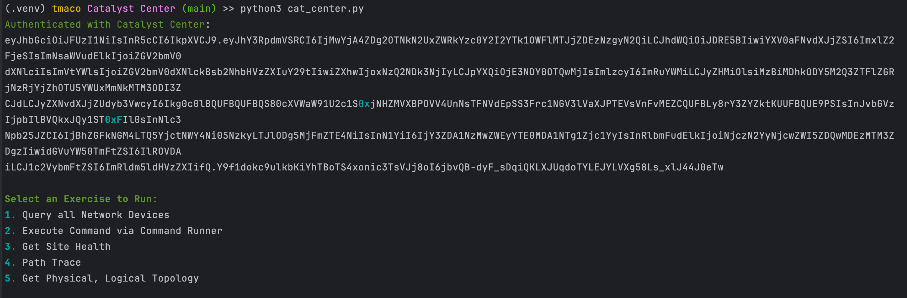
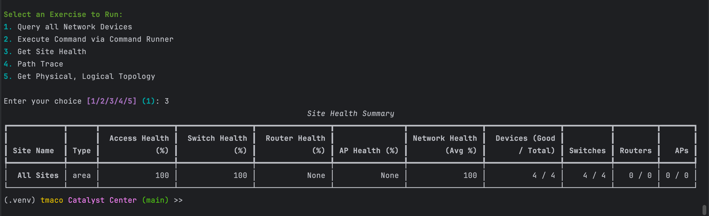
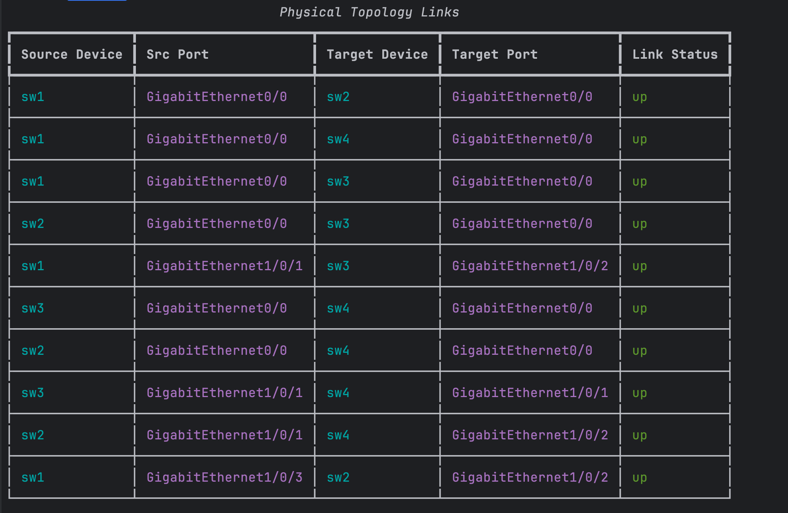
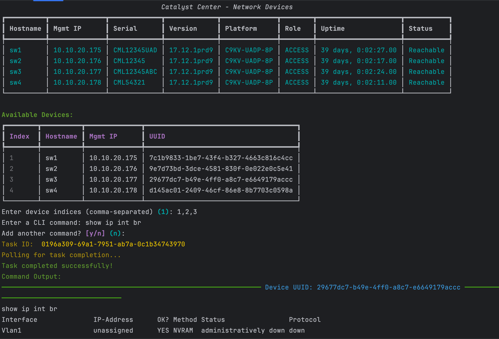

# Cisco Catalyst Center API Lab

This lab demonstrates how to interact with the Cisco Catalyst Center API using Python and the REST API (no SDK). The script includes a CLI menu powered by Rich to perform common tasks such as querying devices, executing CLI commands remotely, and checking site health.

## Features
- Login and token management (auto-refresh)
- Interactive menu to trigger API workflows:
  - List all network devices
  - Execute commands via Command Runner
  - Display site health status
  - Show logical and physical topology
  - Execute path trace

## Requirements
- Python 3.8+
- Catalyst Center instance (DNAC)
- Environment variables set in `.env` file:
  ```
  CAT_HOST=your-catalyst-center-ip
  CAT_USER=your-username
  CAT_PASSWORD=your-password
  ```

## Setup
1. Clone this repo or copy the script locally
2. Install dependencies:
   ```
   pip install requests rich python-dotenv
   ```
3. Create a `.env` file with Catalyst Center credentials
4. Run the script:
   ```
   python cat_center.py
   ```

## Menu Options

When launched, you will see an interactive menu with available lab exercises:

- `1. Query all Network Devices`
- `2. Execute Command via Command Runner`
- `3. Get Site Health`
- `4. Path Trace`
- `5. Get Physical and Logical Topology`

Each menu item calls its corresponding method, which interacts with the Catalyst Center API and displays the results using Rich.



## Example CLI Output

### Site Health Table



### Topology Output



### Command Runner Output


