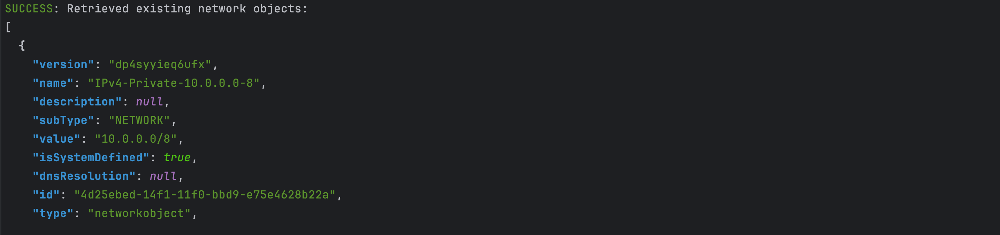
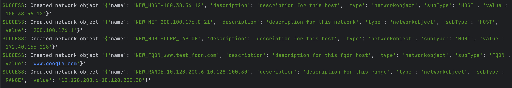
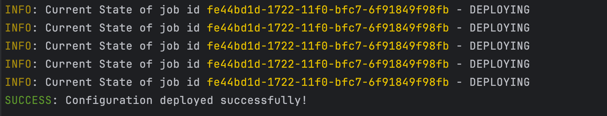

# Cisco FDM API Lab: Network Object Automation

This Python script automates the creation of network objects in Cisco Firepower Device Manager (FDM) using the REST API. It reads from a CSV file, skips existing objects, and deploys the config.

## What it does
- Authenticates to FDM
- Grabs Existing List of Network Objects
- Reads a CSV of network objects (`HOST`, `NETWORK`, `FQDN`, `RANGE`)
- Validates input and creates missing objects
- Deploys configuration and checks status

## Requirements
- Python 3.8+
- FDM with API access
- `.env` file for credentials

### .env Example
```env
FDM_HOST=your-fdm-ip
FDM_PORT=443
FDM_USER=your-username
FDM_PASSWORD=your-password
FDM_VERSION=v6
```

## CSV Format
```csv
Name,Type,Value,Description
Web-Server,host,192.168.1.10,Internal web server
Office-Net,network,10.0.0.0/24,Office LAN
Public-DNS,fqdn,1.1.1.1,Cloudflare DNS
Test-Range,range,192.168.1.1-192.168.1.10,Test IP range
```

## Usage
```bash
python3 creator.py
```

- Get Existing Objects


- Create Objects


- Deploy and Check Job Status
