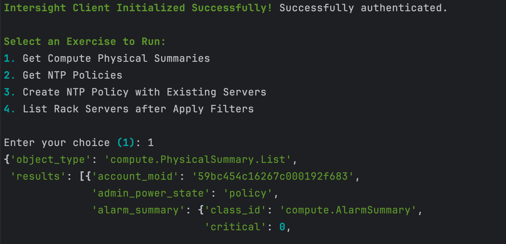
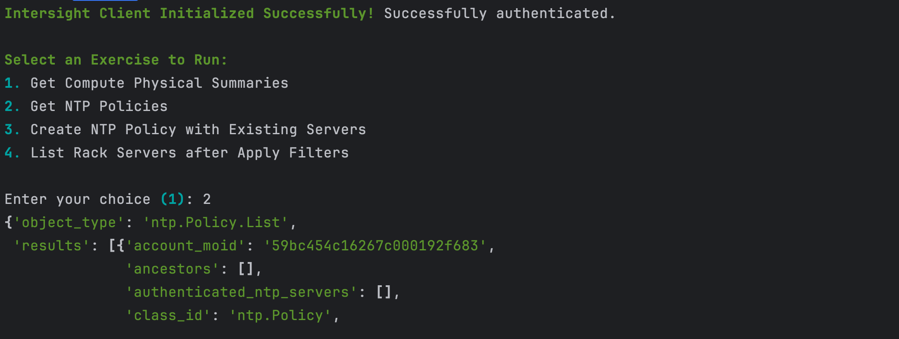
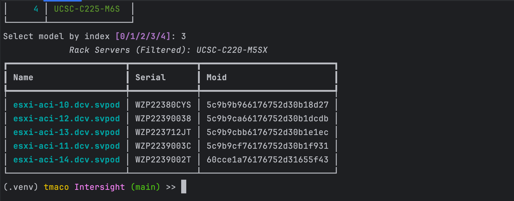

# Cisco Intersight SDK Labs

This lab showcases how to interact with the Cisco Intersight platform using the official Python SDK. It includes interactive exercises for exploring managed infrastructure, filtering data using server-side `$filter` queries, and applying policies like NTP.

## Features
1. List all physical compute summaries (rack servers)
2. Create a new NTP Policy using interactive prompts
3. Filter physical rack servers using `$filter` (by model)

## Prerequisites

- Python 3.8+
- Cisco Intersight Account
- An API Key and downloaded Secret Key (.pem or .txt)
- Required Python packages:
  ```bash
  pip install intersight rich python-dotenv
  ```

- Create a `.env` file with the following:
  ```env
  INTERSIGHT_API_KEY_ID=<your_api_key_id>
  INTERSIGHT_API_SECRET_FILE=./SecretKey.txt
  ```
  
## Usage

When launched, you will see an interactive menu with available lab exercises:

- `1. List Physical Rack Servers`
- `2. Create NTP Policy`
- `3. Filter Rack Servers by Model`

## Example CLI Output

### List Physical Rack Servers



### Create NTP Policy



### Filter Rack Servers by Model



## Notes

- All calls use `intersight.api.<APIGroup>Api` classes
- Policies must be linked with valid `MoRef` references for multi-tenant compatibility
- NTP Policy creation expects `server_ip_address` values, not `MoRef`s
- SDK auto-handles pagination unless additional control is required
- **Multi-Tenancy Handling**: Prompts user to select organization and constructs a `MoRef` as required

