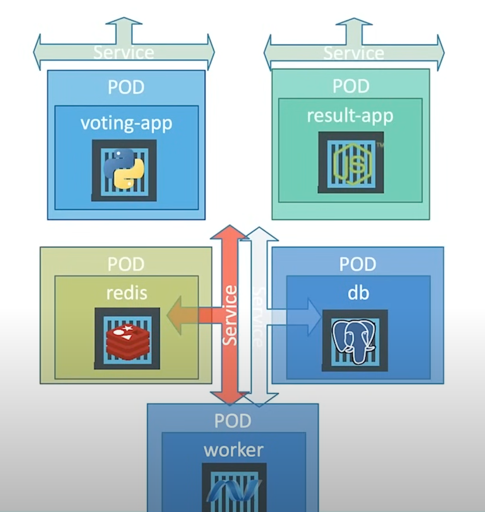
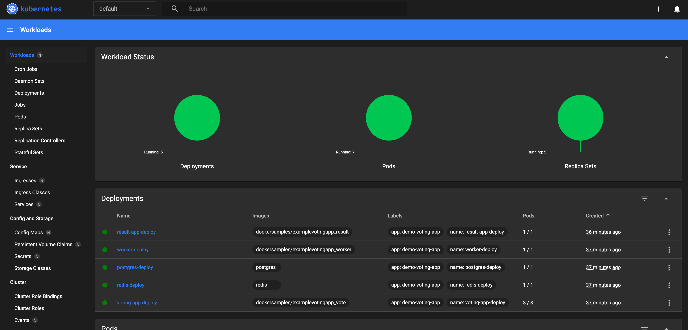
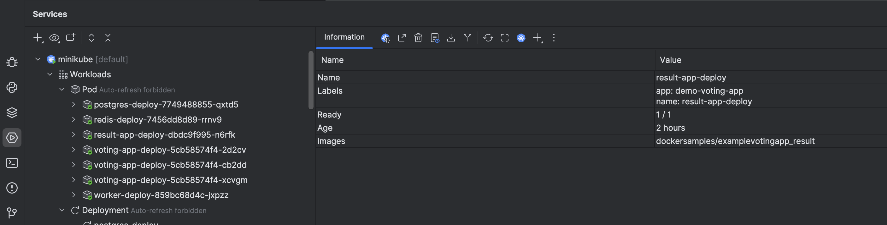
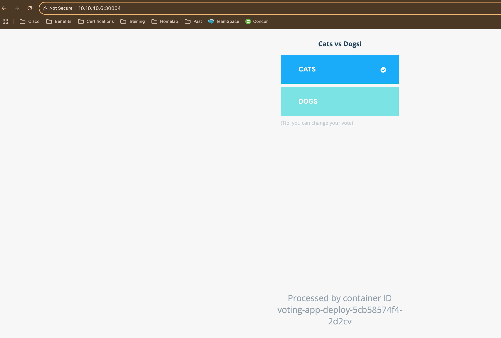
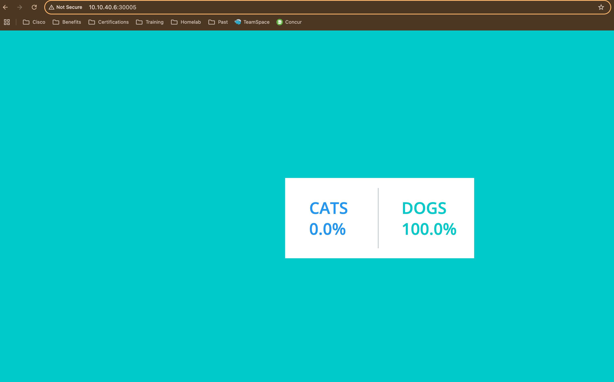

# Kubernetes Voting App (Minikube Lab)

This project is a hands-on lab deployment of a multi-tier microservices application on Kubernetes using Minikube as the local development cluster. It’s based on the [Docker Voting App](https://github.com/dockersamples/example-voting-app) and follows the tutorial by TechWorld with Nana.

Course: https://www.youtube.com/watch?v=XuSQU5Grv1g

## Stack Overview

This simple demo app contains the following components:

| Component     | Description                              | Image                              |
|---------------|------------------------------------------|-------------------------------------|
| Voting App    | Frontend web app to vote (Cats vs Dogs)  | `dockersamples/examplevotingapp_vote` |
| Redis         | Stores votes                             | `redis:alpine`                      |
| Worker        | Processes votes and updates PostgreSQL   | `dockersamples/examplevotingapp_worker` |
| PostgreSQL    | Stores final vote data                   | `postgres:9.4`                      |
| Result App    | Displays the result dashboard            | `dockersamples/examplevotingapp_result` |

A visual diagram of the app architecture:



## Minikube

This lab was built and deployed on a Minikube cluster on a remote Linux Server using the Docker engine. In order to access the various apps through their NodePort services, **ports must be mapped via docker when launching the cluster**.
```shell
# Example command to launch minikube
minikube start --driver=docker \
  --ports=30000-30050:30000-30050 \
  --ports=32769:8443 \
  --ports=32400:32400 \
  --apiserver-ips=`<remote server ip>` \
  --listen-address=0.0.0.0
```
This command does the following:
- Maps ports `30000-30050` to host ports for cluster pods that need reachability from a remote machine
- Exposes the API for remote kubectl execution via port mapping `32769:8443`, and assigning ip `apiserver-ips=<remote server ip>` (remote address)
- Exposes kubernetes dashboard via port mapping `32400:32400`, so the dashboard is accessible at `<remote server ip>`:`32400`

To utilize the kubernetes dashboard, launch the dashboard and expose it via NodePort to the mapped port `32400`
```shell
minikube addons enable dashboard

kubectl patch svc kubernetes-dashboard -n kubernetes-dashboard \
  -p '{"spec": {"type": "NodePort", "ports": [{"port": 80, "targetPort": 9090, "nodePort": 32400}]}}'
```

## Deploying the App

Apply each deployment YAML file using:

```bash
kubectl create -f redis-deploy.yaml
kubectl create -f postgres-deploy.yaml
kubectl create -f worker-deploy.yaml
kubectl create -f voting-app-deploy.yaml
kubectl create -f result-app-deploy.yaml
```

Once all pods are running, deploy the various services to connect the pods together and expose the apps.
```shell
kubectl create -f postgres-service.yaml
kubectl create -f redis-service.yaml
kubectl create -f result-app-service.yaml
kubectl create -f voting-app-service.yaml
```

To check the status of everything, you can use the dashboard:



Or via pycharm remote connection:



## Accessing the Apps

Both the Voting App and Result App are exposed via NodePort. You can access their URLs using:
- `Voting App`: `<remote server ip>`:30004
- `Results App`: `<remote server ip>`:30005





## Cleanup

To remove all resources:

```bash
kubectl delete -f .
```

Or delete Minikube entirely:

```bash
minikube delete
```