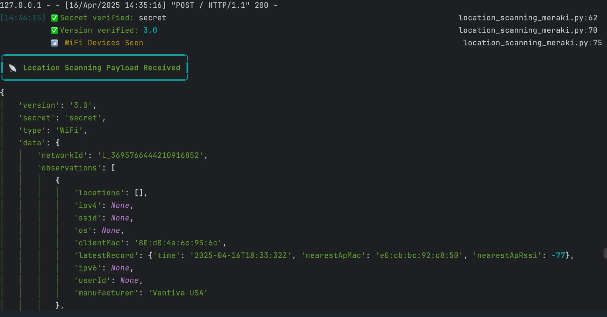

# Meraki Scanning API Lab: Real-Time Device Tracker

This Python lab sets up a Flask server to receive data from the Cisco Meraki Scanning API and visualize it in the terminal using the Rich library. It tracks unique MAC addresses and shows the most recent time each device was seen, in Eastern Time.

## What It Does
- Listens for POST requests from Meraki Scanning API
- Validates and processes incoming location data
- Tracks unique MAC addresses seen via WiFi or Bluetooth
- Displays a running terminal table with MAC address and last seen time

## Requirements
- Python 3.8+
- Flask
- Rich
- pytz
- Ngrok (or Podman-based alternative to expose localhost)
- Meraki Dashboard with Scanning API enabled
- `.env` file for `Validator` and `Secret`

### .env Example
```env
VALIDATOR=your-validator
SECRET=your-secret
```

## Usage
1. Expose your localhost using Ngrok or a Podman-based alternative:
```bash
podman run -it --rm   -e NGROK_AUTHTOKEN=<token> ngrok/ngrok:latest http http://host.containers.internal:5050
```
2. Start the Flask server:
```bash
python3 location_scanning.py
```

- Receiving Post Requests:
