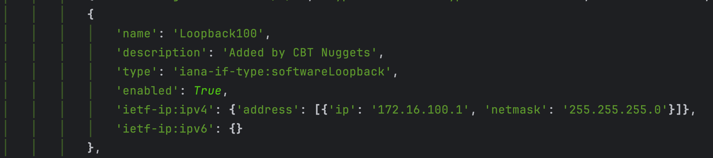

# RESTCONF Interface Configuration Lab (Python)

This lab demonstrates how to use Python to **create a new Loopback interface** on a Cisco IOS XE device via the RESTCONF API.

## Lab Goals

- Learn how to interact with RESTCONF from Python using `requests`
- Learn how to structure YANG-based payloads (using `ietf-interfaces`)
- Understand how to POST data to configure interfaces

## Files

- `get-interfaces.py`: Python script to GET existing interfaces
- `create-interface.py`: Python script to POST a new Loopback interface

## Prerequisites

- Cisco IOS XE device with RESTCONF enabled
- Python 3.8+
- Enable RESTCONF on the device:
  ```bash
  conf t
  restconf
  ```

## Usage

1. Run the `get-interfaces.py` script to validate connectivity and check existing interfaces:
   ```bash
   python get-interfaces.py
   ```
   
2. Run the `create-interface.py` script to create a new Loopback interface:
   ```bash
    python create-interface.py
    ```



## Script Breakdown

- Builds the RESTCONF endpoint:  
  `https://<host>:443/restconf/data/ietf-interfaces:interfaces`
- Sets appropriate headers for YANG JSON
- Sends a `POST` request to create Loopback100:
  - `ip`: `172.16.100.1`
  - `netmask`: `255.255.255.0`
- Uses `verify=False` to skip SSL checks (lab only)
- Suppresses warnings from `urllib3`
- Uses `rich` for clean terminal output

## RESTCONF Model Discovery Process

To figure out what YANG modules and RESTCONF paths are available on a Cisco device, follow this logic:

1. **Check supported capabilities**  
   `GET /restconf/data/netconf-state/capabilities`  
   This shows supported YANG models like `ietf-interfaces`.

2. **List all loaded YANG modules**  
   `GET /restconf/data/ietf-yang-library:modules-state`  
   Use this to inspect available modules and get schema URLs.

3. **Access the YANG schema tree (if supported)**  
   Example: `GET /restconf/tailf/modules/ietf-interfaces/2014-05-08`
    - Use `pyang` to convert YANG files to a visual, condensed tree structure:
      ```bash
      pyang -f tree ietf-interfaces.yang
      ```

4. **Identify supported paths and operations**  
   Look through the schema or use documentation to understand:
   - What endpoints exist, from containers to leaves
   - What data structures are accepted, their format, and types
   - What HTTP methods are supported (`GET`, `POST`, `PUT`, etc.) (`ro` for read-only, `rw` for read-write)

5. **Build RESTCONF calls accordingly**  
   Use headers:
   ```http
   Accept: application/yang-data+json
   Content-Type: application/yang-data+json
   ```
   and refer to paths based on the schema tree, e.g.:  
   `/restconf/data/ietf-interfaces:interfaces/interface=Loopback100`