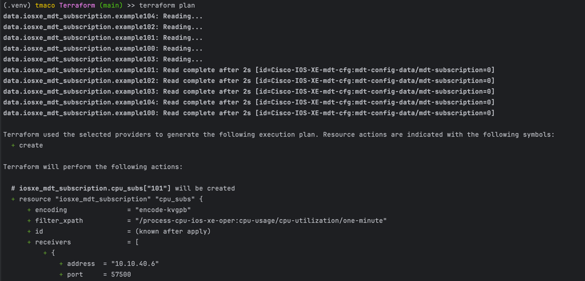

# Terraform IOS XE Telemetry Configuration Lab

This lab demonstrates how to configure model-driven telemetry on Cisco IOS XE devices using **Terraform** with the `cisco-iosxe` provider.

Provider Docs: https://registry.terraform.io/providers/CiscoDevNet/iosxe/latest/docs

## Lab Goals

- Enable and configure telemetry subscriptions on IOS XE
- Use Terraform to automate configuration deployment
- Practice init / plan / apply / destroy Terraform workflow

## Prerequisites

- Cisco IOS XE device with:
  - NETCONF/RESTCONF enabled
  - Reachability from host machine
- Terraform installed (`>= 1.0.0`)
- Valid credentials to authenticate with the device


## Lab Files

| File | Purpose |
|------|---------|
| `header.tf` | Provider declaration and device connection info |
| `variables.tf` | Input variables for dynamic config |
| `terraform.tfvars` | Actual values for the input variables |
| `cpu.tf` | Configures telemetry subscription for CPU utilization |
| `interfaces.tf` | Configures telemetry subscription for interface stats |
| `validate_subscriptions.tf` | Validates subscriptions with a read-only query |

## Usage

1. Initialize Terraform Directory
```bash
terraform init
```


2. Visualize changes that will be made, validate everything looks good before applying.
```bash
terraform plan
```


3. Apply the changes to the IOS XE device
```bash
terraform apply --auto-approve
```


4. Validate the subscriptions were created successfully on switch with `show run`


### Optional: Destroy New Config
```bash
terraform destroy --auto-approve
```
