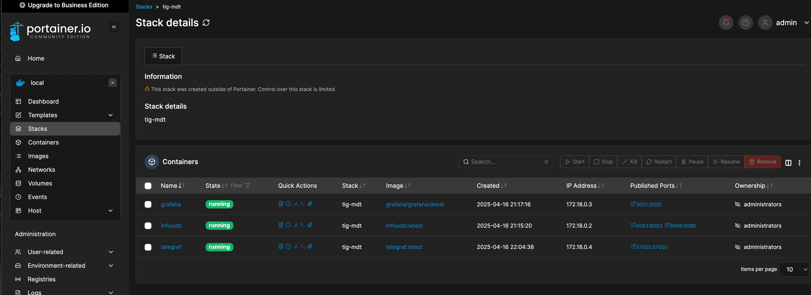
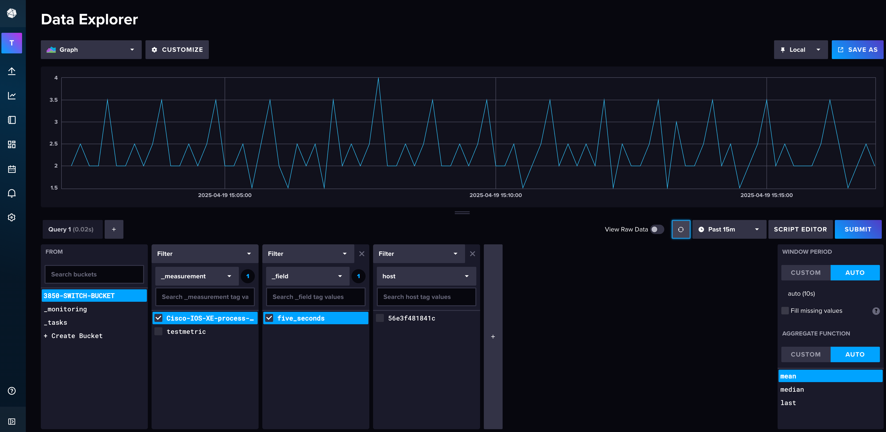
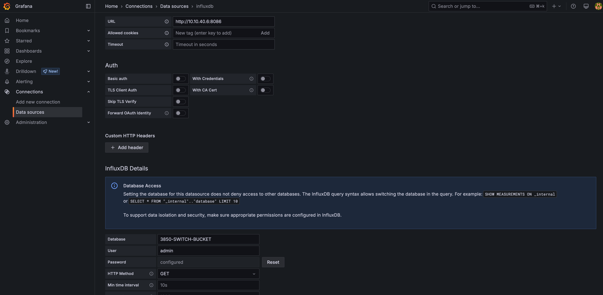
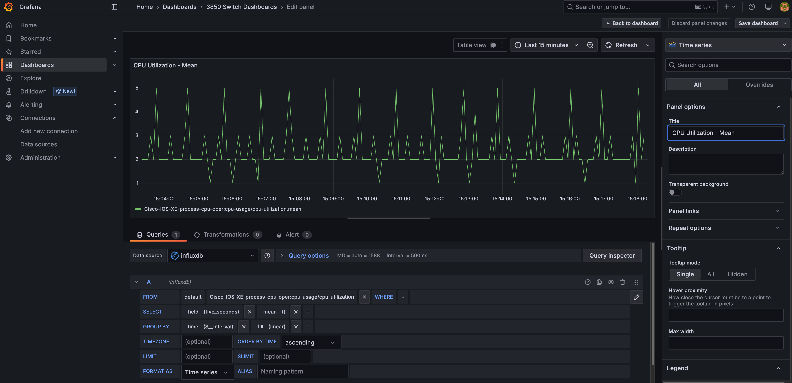

# Cisco IOS XE MDT Telemetry with InfluxDB and Grafana

This lab demonstrates how to stream **CPU data** from a Cisco IOS XE device into **InfluxDB**, using **NETCONF-YANG with YANG Push** and visualize it with **Grafana**. (TIG stack: Telegraf, InfluxDB, Grafana)
This lab is expecting a Linux environment to run each of these containers!

## Lab Components

- **Cisco IOS XE Switch**
  - Source of telemetry data using `ietf-telemetry` with `encode-kvgpb`
- **Ubuntu Server (Docker Host)**
  - `Telegraf`: gRPC receiver + InfluxDB writer
  - `InfluxDB`: Time-series database
  - `Grafana`: Visualization dashboard

## Prerequisites
1. **Configure Telegraf**: Edit the Telegraf.conf file to have the IP Address of the computer that will have the InfluxDB using a text editor (e.g., nano or vim)
```
nano conf/telegraf/telegraf.conf
```
- Edit the URLs line
```
# Cisco MDT Telemetry
[[inputs.cisco_telemetry_mdt]]
  transport = "grpc"
  service_address = ":57000"
  data_format = "influx"

[[outputs.influxdb_v2]]
  urls = ["http://influxdb:8086"]
  token = "ekgDOd0A1nuZzwJkYK-FV59l06Qi6m7w4BZkkPFlrXiURDjBv1rhx6t0ZyNUPURO9y6mgYX-URvQCG53uM6h0A=="
  organization = "TMACO-LAB"
  bucket = "3850-SWITCH-BUCKET"
```

2. **Cisco IOS XE Clock Configuration**:
Ensure the switch has the correct time and timezone set. This is crucial for accurate telemetry data.

> Warning: if the clock is not configured correctly, 'current' streamed data will not show within 5 minutes for example (so it appears broken).

- Check Switch Clock
```shell
show clock detail
show ntp status
```
- If you see 'unsynchronized' in the output, the fix is:
```shell
Clock is unsynchronized, stratum 16, no reference clock
....
ntp server 216.239.35.0
....
Clock is synchronized, stratum 2, reference is 216.239.35.0
```
3. **Enable Streaming Telemetry for 5 second CPU measurements on IOS-XE**:
```plaintext
telemetry ietf subscription 1
 encoding encode-kvgpb
 filter xpath /process-cpu-ios-xe-oper:cpu-usage/cpu-utilization/five-seconds
 source-address <switch source ip address>
 stream yang-push
 update-policy periodic 500
 receiver ip address <ip address where telegraf is> 57000 protocol grpc-tcp
```

## Usage
1. Start up the containers using Docker Compose:
- `influxdb`
- `telegraf`
- `grafana`

Telegraf should be listening on `port 57000` for `grpc-tcp` connections and be configured with:
- `inputs.cisco_telemetry_mdt`
- `outputs.influxdb_v2` pointing to your InfluxDB instance



2. After a few minutes, verify data is in InfluxDB:
```shell
docker exec -it influxdb influx query --org TMACO-LAB \
  'from(bucket:"3850-SWITCH-BUCKET")
   |> range(start: 0)
   |> keep(columns: ["_time", "_field", "_value", "_measurement"])'
   
...

_field       _measurement                                         _time                           _value
five_seconds Cisco-IOS-XE-process-cpu-oper:cpu-utilization       2025-04-16T12:02:15.178Z         3
```

You can also log into the InfluxDB dashboard with `admin/Cisco!234` and verify the data is present with a query:



3. Login to the Grafana admin panel via `http://localhost:3000` with the default user/password as `admin/Cisco!234`.
4. Add a new data source in Grafana with the following config:



5. Create a new dashboard panel with the following config:
- Query: Select from 3850-SWITCH-BUCKET 
- Measurement: cpu-utilization 
- Field: five_seconds 
- Function: mean()
- Group By: _time (e.g., per 1s interval)

You’ll now see real-time CPU usage displayed!

