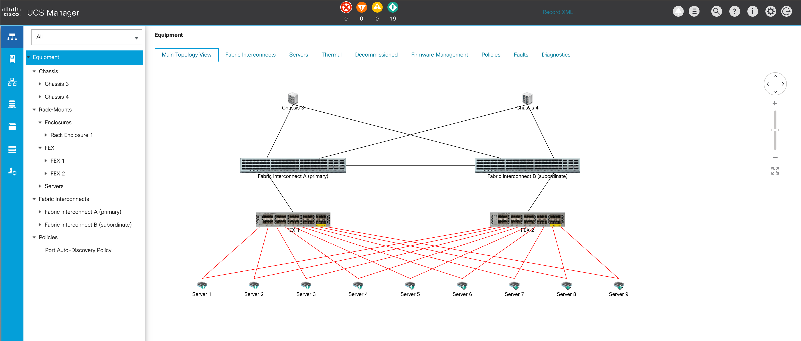
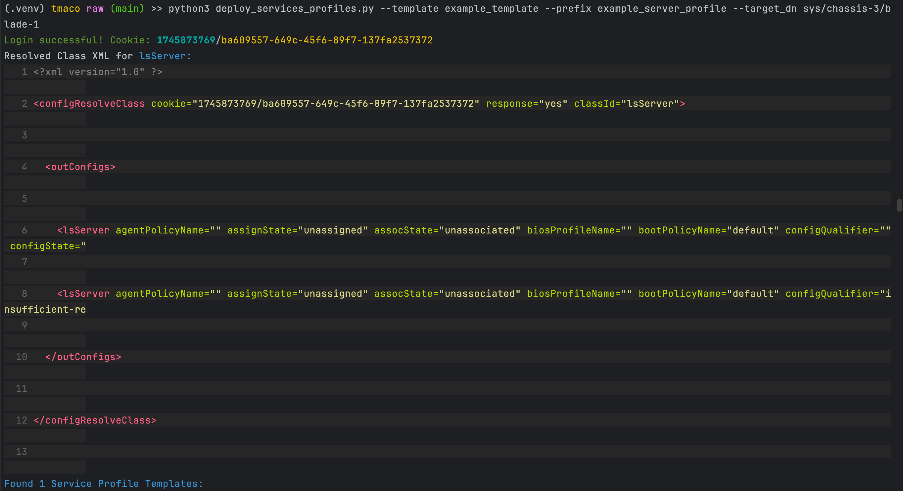
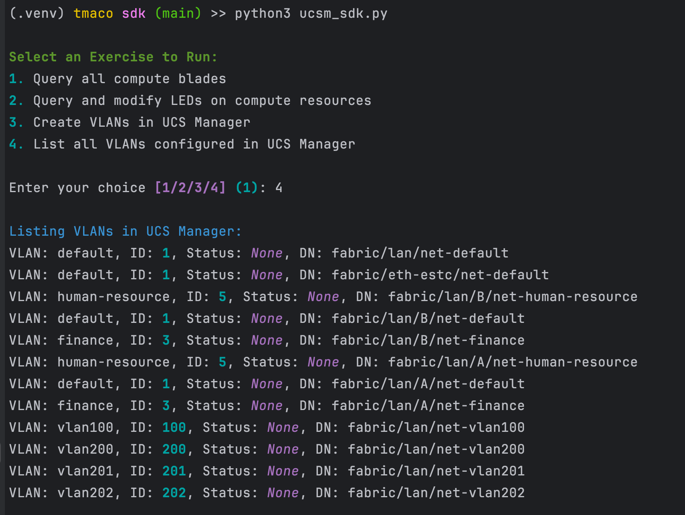

# Cisco UCS Manager API Labs

This repository contains two Python-based labs demonstrating how to automate Cisco UCS Manager tasks:

- **Raw XML API approach** (direct XML payloads without SDK)
- **Python SDK approach** (using Cisco's official `ucsmsdk`)

Both labs connect to UCS Manager (or UCSPE emulator) and perform basic automation tasks including Service Profile provisioning and VLAN management.

## Prerequisites
### UCSPE Emulator
Use the Cisco UCS Platform Emulator (UCSPE) for testing. Setup as VM in lab environment.
Follow guide here: https://www.youtube.com/watch?v=A9Ux5TZ7JOg



### .env Example
```env
UCS_HOST=10.10.40.30
UCS_USER=admin
UCS_PASSWORD=password
```

## Lab 1: Raw XML API (`ucs_raw_xml_api.py`)

This lab manually builds and sends XML API requests without any SDK or helper libraries.

### Features:
- Connects to UCS Manager and logs in (`aaaLogin`)
- Lists available Service Profile Templates (`configResolveClass` on `lsServer`)
- Creates a **Service Profile** from an existing **Template**
- Binds (associates) the new Service Profile to a target blade (`lsBinding`)
- Pretty-prints UCS Manager XML responses for easier debugging

### Usage:

**Arguments:**
- `--template` → Name of the Service Profile Template to use
- `--prefix` → Name for the new Service Profile
- `--target_dn` → DN (Distinguished Name) of the blade/server to associate

```bash
python ucs_raw_xml_api.py --template TEMPLATE_NAME --prefix NEW_PROFILE_NAME --target_dn SERVER_DN
```



## Lab 2: UCS Manager Python SDK (`ucs_sdk_api.py`)

This lab uses Cisco's **`ucsmsdk`** library to simplify API interaction with UCS Manager.

### Features:
- Query all Compute Blades
- Toggle Locator LEDs on servers (on/off)
- Create multiple VLANs
- List all VLANs
- Delete VLANs (excluding VLAN 1)
- Interactive **exercise menu** powered by Rich prompts

### Supported Exercises:
| # | Task |
|:-|:---|
| 1 | Query all compute blades |
| 2 | Query and modify LEDs on compute resources |
| 3 | Create VLANs in UCS Manager |
| 4 | List all VLANs configured in UCS Manager |
| 5 | Delete VLANs in UCS Manager |

### Usage:

```bash
python ucs_sdk_api.py
```

You will be prompted to select an exercise from the Rich terminal menu.



## Notes and Best Practices

- **SSL Warning Suppression:**  
  SSL certificate verification is disabled for simplicity (`verify=False`). Use valid certificates in production environments.

- **UCSPE Testing:**  
  Scripts were developed and tested against Cisco UCS Platform Emulator (UCSPE) 4.2(2aS9).

- **Common API Pitfalls:**  
  - UCS Manager always returns HTTP 200 even on errors — **always check `errorCode` and `errorDescr` inside XML!**
  - Some UCS fields like `dn` (Distinguished Name) are required even if not clearly documented.
  - Implicit fields (e.g., `pnDn`) cannot be modified directly — use binding methods.
